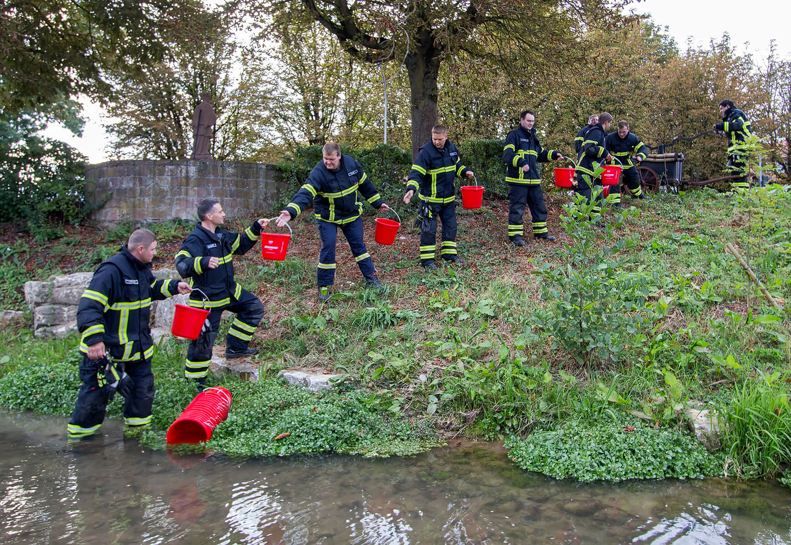

# corrente-de-responsabilidade

Implementando padrão corrente de responsabilidade ná prática

<!-- image src https://www.fnweb.de/orte/buchen_artikel,-buchen-eimerkette-und-historische-loeschuebung-_arid,1099453.html?&npg -->

Palavras Chaves:

-   Sequencial
-   Ordenado
-   Dinamico

## Apresentação

refs:

-   https://refactoring.guru/design-patterns/chain-of-responsibility
-   https://github.com/RefactoringGuru/design-patterns-typescript/blob/main/src/ChainOfResponsibility/RealWorld/index.ts
